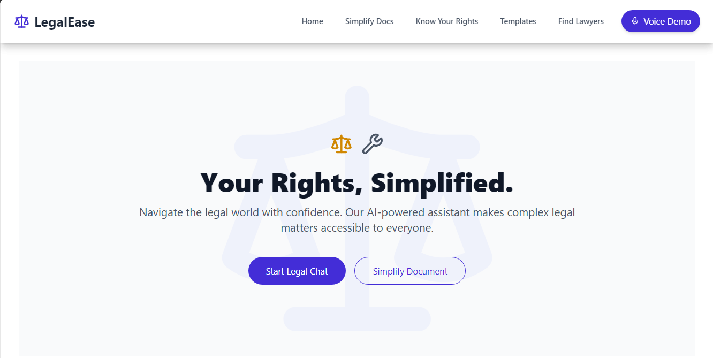
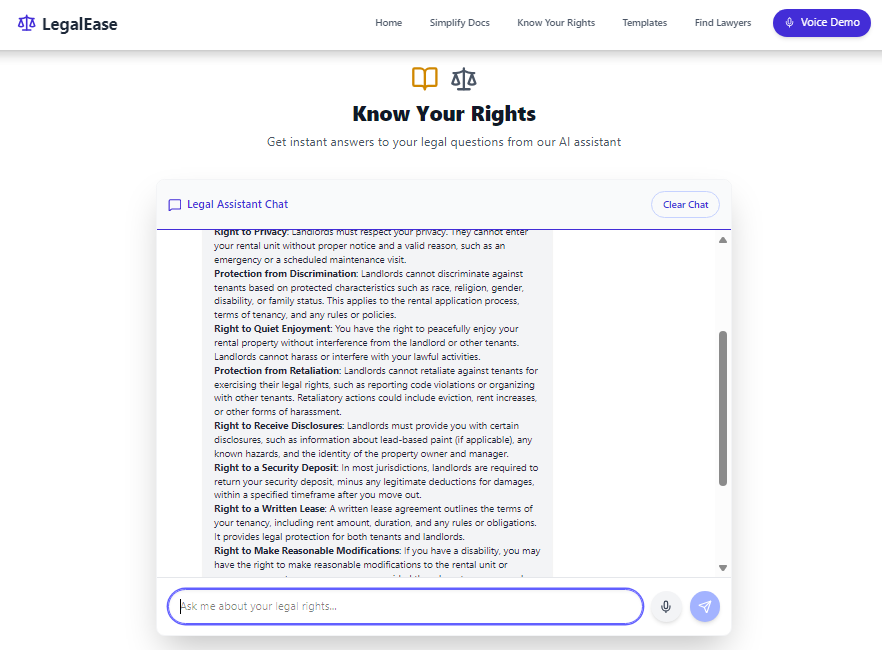
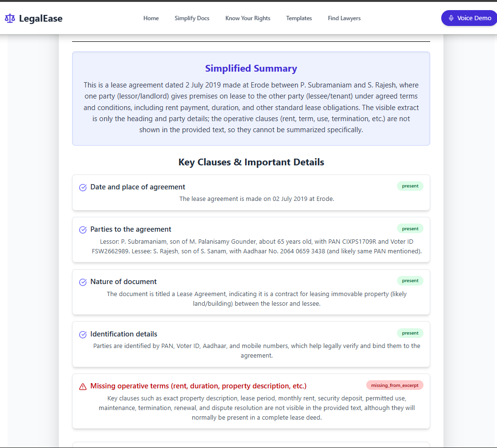
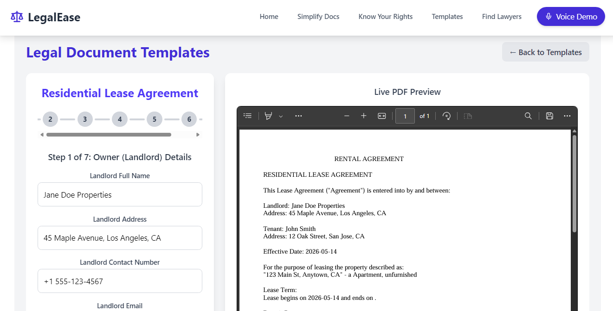
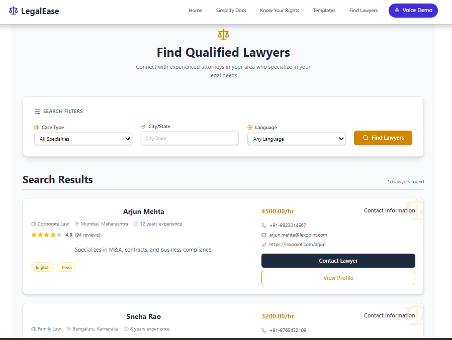

<div align="center">

<!-- Replace the banner below with your actual banner image -->
<!-- Recommended: 1280×640px, dark background with the LegalEase logo -->


# ⚖️ LegalEase

**Understand your rights. Simplify complex laws. Find the right lawyer.**

[](https://reactjs.org/)
[](https://expressjs.com/)
[](https://fastapi.tiangolo.com/)
[](https://cohere.com/)
[](https://mysql.com/)
[](https://github.com/facebookresearch/faiss)

[🚀 Get Started](#-getting-started) · [✨ Features](#-features) · [🏗️ Architecture](#️-architecture) · [📸 Screenshots](#-screenshots) · [🗺️ Roadmap](#️-roadmap)

</div>

---

## 🧭 What is LegalEase?

LegalEase is a full-stack AI-powered legal assistant that bridges the gap between complex legal jargon and everyday understanding. Whether you're reviewing a contract, looking for a lawyer, or just want to know your rights — LegalEase has you covered.

> ⚠️ **Disclaimer:** LegalEase is designed to help users *understand* legal information, not to replace a licensed attorney. Always consult a qualified legal professional for advice specific to your situation.

---



## ✨ Features

<table>
<tr>
<td width="50%">

### 💬 Know Your Rights
Ask legal questions in a natural chat interface powered by Cohere AI. Get clear, markdown-formatted guidance on any legal topic.

<!-- Add a screenshot: frontend/screenshots/chat.png -->


</td>
<td width="50%">

### 📄 Simplify Legal Docs
Upload a PDF or image of any legal document. LegalEase extracts, summarizes, and translates it into plain English — with key clauses highlighted.

<!-- Add a screenshot: frontend/screenshots/simplify.png -->


</td>
</tr>
<tr>
<td width="50%">

### 🗂️ Legal Document Templates
Fill out form-based legal templates and see a live PDF preview update in real time. Export when ready.

<!-- Add a screenshot: frontend/screenshots/templates.png -->


</td>
<td width="50%">

### 🔍 Find a Lawyer
Search a curated lawyer directory filtered by specialization, city, and language spoken.

<!-- Add a screenshot: frontend/screenshots/lawyers.png -->


</td>
</tr>
</table>

---

## 🏗️ Architecture

LegalEase is split into three independent services:

```

┌─────────────────────────────────────────────────────────────┐
│                        Browser                              │
│                    React Frontend (Vite)                    │
│         Chat · Simplify · Templates · Find Lawyers          │
└──────────────┬──────────────────────┬───────────────────────┘
               │                      │
               ▼                      ▼
┌──────────────────────┐  ┌──────────────────────────────────┐
│   Express Backend    │  │         FastAPI Service          │
│  /chat  /simplifier  │  │  /upload  →  FAISS Index         │
│  /translator /lawyer │  │  /query   →  RAG + Cohere        │
└──────────┬───────────┘  └──────────────────────────────────┘
           │
           ▼
┌──────────────────────┐
│   MySQL Database     │
│   Lawyer Directory   |
|   API calls          |
└──────────────────────┘

```


**Request flow:**
1. User opens the React app and picks a tool.
2. Frontend sends a request to the Express backend or FastAPI service.
3. The backend calls Cohere / NVIDIA AI models and returns structured output.
4. The frontend renders the response — markdown, PDF preview, or a lawyer card.

---

## 📁 Project Structure

```
legalease/
├── backend/
│   ├── server.js
│   └── routes/
│       ├── chat.js
│       ├── lawyer.js
│       ├── simplifier.js
│       └── translator.js
│
├── fastapi/
│   └── Scripts/
│       ├── main.py
│       └── requirements.txt
│
└── frontend/
    └── src/
        ├── App.jsx
        ├── Components/
        └── Templates/
```

---

## 🚀 Getting Started

### Prerequisites

- Node.js ≥ 18
- Python ≥ 3.9
- MySQL instance running
- API keys for Cohere and NVIDIA

---

### 1️⃣ Backend

```bash
cd backend
npm install
npm start
```

Create a `.env` file in `backend/`:

```env
PORT=5000
CLIENT_URL=http://localhost:5173

COHERE_API_KEY=your_cohere_key
COHERE_MODEL=command-r-plus

NVIDIA_API_KEY=your_nvidia_key
NVIDIA_MODEL=your_nvidia_model

DB_HOST=localhost
DB_USER=root
DB_PASSWORD=your_password
DB_NAME=legalease
DB_PORT=3306
```

---

### 2️⃣ Frontend

```bash
cd frontend
npm install
npm run dev
```

Create a `.env` file in `frontend/`:

```env
VITE_EXPRESS_API_URL=http://localhost:5000
VITE_FAST_API_URL=http://localhost:8000
```

---

### 3️⃣ FastAPI Service

```bash
cd fastapi/Scripts
pip install -r requirements.txt
uvicorn main:app --reload --port 8000
```

---

## 📡 API Reference

### Express Backend

| Method | Endpoint | Description |
|--------|----------|-------------|
| `POST` | `/chat` | Send a legal question; returns a markdown response via Cohere |
| `POST` | `/simplifier` | Send legal text; returns a structured JSON summary (key clauses, plain-English) |
| `POST` | `/translator` | Translate a summary JSON while preserving structure |
| `GET` | `/lawyer/lawyers` | Search lawyers by specialization, city, and language |
| `GET` | `/lawyer/:id` | Get a single lawyer record by ID |

### FastAPI Service

| Method | Endpoint | Description |
|--------|----------|-------------|
| `POST` | `/upload` | Upload a PDF → extract → chunk → embed → store in FAISS |
| `POST` | `/query` | Ask a question; retrieves relevant chunks and returns a grounded answer |

---

## 🗄️ Database Schema

The lawyer search feature requires a MySQL `Lawyer` table with the following fields:

| Field | Type | Notes |
|-------|------|-------|
| `lawyer_id` | INT | Primary key |
| `first_name` | VARCHAR | — |
| `last_name` | VARCHAR | — |
| `specialization` | VARCHAR | e.g. Criminal, Family, Corporate |
| `city` | VARCHAR | — |
| `state` | VARCHAR | — |
| `experience_years` | INT | — |
| `rating` | DECIMAL | 0.0 – 5.0 |
| `hourly_rate` | DECIMAL | In local currency |
| `bio` | TEXT | Short profile description |
| `languages` | VARCHAR | Comma-separated |
| `phone` | VARCHAR | — |
| `email` | VARCHAR | — |
| `website_url` | VARCHAR | Optional |

---


Suggested screenshots to capture:

- [ ] `chat.png` — Know Your Rights chat interface
- [ ] `simplify.png` — Document Simplifier with a sample PDF loaded
- [ ] `templates.png` — Template editor with live PDF preview
- [ ] `lawyers.png` — Lawyer search results with filters applied
- [ ] `home.png` — Landing page / home screen

---

## 🗺️ Roadmap

- [ ] Add `.env.example` files for all three services
- [ ] Deployment guide (Vercel · Railway · Render)
- [ ] Add screenshots for all pages
- [ ] User authentication and saved document history
- [ ] Support for more document types (DOCX, images via OCR)
- [ ] Multi-language UI (not just translated output)
- [ ] Lawyer profile pages with booking/contact flow

---

## 🤝 Contributing

Contributions are welcome! Please open an issue first to discuss what you'd like to change.

1. Fork the repo
2. Create your branch: `git checkout -b feature/your-feature`
3. Commit your changes: `git commit -m 'Add some feature'`
4. Push to the branch: `git push origin feature/your-feature`
5. Open a Pull Request

---

<div align="center">

Built with ❤️ to make legal help accessible to everyone.

</div>
